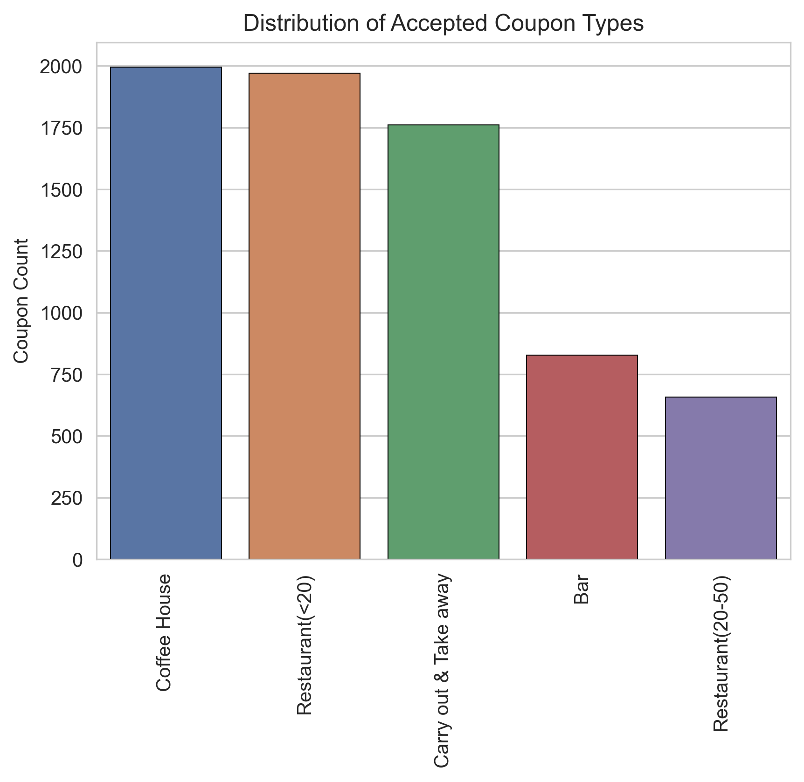
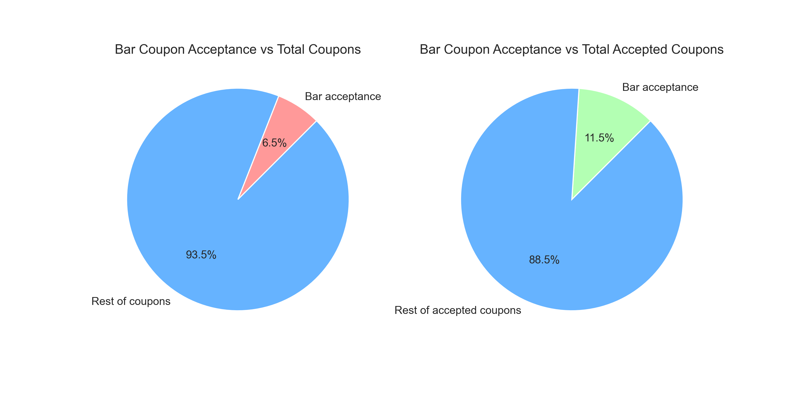
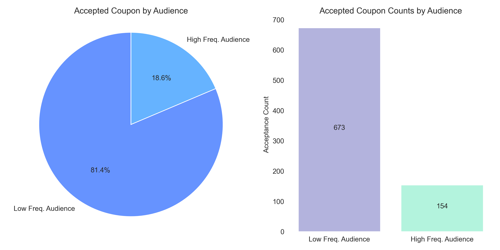

# Will a Customer Accept the Coupon?

**Context**

Imagine driving through town and a coupon is delivered to your cell phone for a restaraunt near where you are driving. Would you accept that coupon and take a short detour to the restaraunt? Would you accept the coupon but use it on a sunbsequent trip? Would you ignore the coupon entirely? What if the coupon was for a bar instead of a restaraunt? What about a coffee house? Would you accept a bar coupon with a minor passenger in the car? What about if it was just you and your partner in the car? Would weather impact the rate of acceptance? What about the time of day?

Obviously, proximity to the business is a factor on whether the coupon is delivered to the driver or not, but what are the factors that determine whether a driver accepts the coupon once it is delivered to them? How would you determine whether a driver is likely to accept a coupon?

**Overview**

The goal of this project is to use what you know about visualizations and probability distributions to distinguish between customers who accepted a driving coupon versus those that did not.

**Data**

This data comes to us from the UCI Machine Learning repository and was collected via a survey on Amazon Mechanical Turk. The survey describes different driving scenarios including the destination, current time, weather, passenger, etc., and then ask the person whether he will accept the coupon if he is the driver. Answers that the user will drive there ‘right away’ or ‘later before the coupon expires’ are labeled as ‘Y = 1’ and answers ‘no, I do not want the coupon’ are labeled as ‘Y = 0’.  There are five different types of coupons -- less expensive restaurants (under \\$20), coffee houses, carry out & take away, bar, and more expensive restaurants ($20 - $50).

### Data Description
Keep in mind that these values mentioned below are average values.

The attributes of this data set include:
1. User attributes
    -  Gender: male, female
    -  Age: below 21, 21 to 25, 26 to 30, etc.
    -  Marital Status: single, married partner, unmarried partner, or widowed
    -  Number of children: 0, 1, or more than 1
    -  Education: high school, bachelors degree, associates degree, or graduate degree
    -  Occupation: architecture & engineering, business & financial, etc.
    -  Annual income: less than $12500 , $12500 - $24999, $25000 - $37499, etc.
    -  Number of times that he/she goes to a bar: 0, less than 1, 1 to 3, 4 to 8 or greater than 8
    -  Number of times that he/she buys takeaway food: 0, less than 1, 1 to 3, 4 to 8 or greater
       than 8
    -  Number of times that he/she goes to a coffee house: 0, less than 1, 1 to 3, 4 to 8 or
       greater than 8
    -  Number of times that he/she eats at a restaurant with average expense less than \$20 per
       person: 0, less than 1, 1 to 3, 4 to 8 or greater than 8
    -  Number of times that he/she goes to a bar: 0, less than 1, 1 to 3, 4 to 8 or greater than 8
   
2. Contextual attributes
    - Driving destination: home, work, or no urgent destination
    - Location of user, coupon and destination: we provide a map to show the geographical
      location of the user, destination, and the venue, and we mark the distance between each
      two places with time of driving. The user can see whether the venue is in the same
      direction as the destination.
    - Weather: sunny, rainy, or snowy
    - Temperature: 30F, 55F, or 80F
    - Time: 10AM, 2PM, or 6PM
    - Passenger: alone, partner, kid(s), or friend(s)

3. Coupon attributes
    - time before it expires: 2 hours or one day

## I. Initial Analysis

#### 1. What proportion of the total observations chose to accept the coupon?

Coupon acceptance rate is `56.84%`. Accepted coupons are distributed as follows:

(Figure 1.1) 

Given the fact that *Coffee House* coupons are the best performers, I will be analyzing them. 
But let's first analyze *Bar* coupons and see if their performance can be improved. 

## II. Bar coupons analysis

#### 1. What proportion of bar coupons were accepted?

Accepted Bar coupons represent `11.5%` of accepted coupons and `6.5%` of total coupons (accepted or not).

(Figure 2.1) 

#### 2. Identifying drivers behaviour around Bar attendance

**2.1 Scoring System**

To better analyze the behaviour, a scoring system was created based on the following criteria:

(Figure 2.1) 

| Attendance (per month) | Score Value |
|------------------------|-------------|
| never                  | 0           |
| less than 1            | 1           |
| between 1 and 3        | 2           |
| between 4 and 8        | 6           |
| more than 8            | 9           |

**2.2 Behaviour Analysis**

Bar coupon acceptance is heavily driven by drivers habits.
The following graph shows how people who score up to a `2` are most likely to accept a coupon.
Chances of accepting a coupon drops dramatically if the driver scores more.
Most coupons are rejected by people that never go to bars (which makes perfect sense).
Seems like the sweet spot is the score between **1 and 2**

(Figure 2.2) 

**Hypothesis:** 
*Bar coupon acceptance is driven by people that go to bars up to 3 times per month.* 

**2.3 Looking deeper into the Hypothesis**

Created two audiences (Low and High Frequency) based on bar attendance. The definitions are as follows:

- *Low frequency Audience: those who went to a bar 3 or fewer times a month*
- *High frequency Audience: those who went to a bar more than 3 times a month*

When looking at the accepted coupons of these two audiences,
it's clear that most of the coupons are coming from the *Low frequency Audience*. Which is consistent with the hypothesis.

(Figure 2.3) 

**2.4 Final thoughts on Bar Coupons**

**Conclusion:**
*Offer less coupons to people that never go to bars and more to people that go up to 3 times per month.*